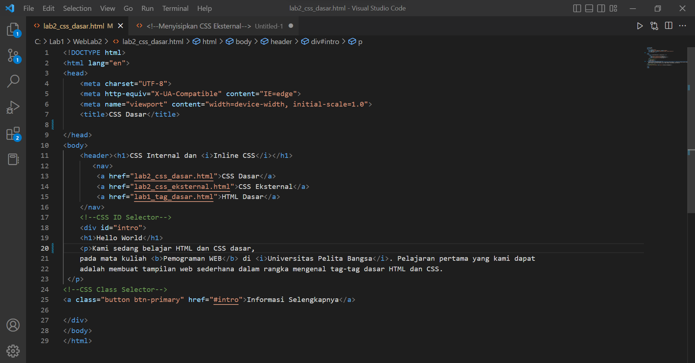
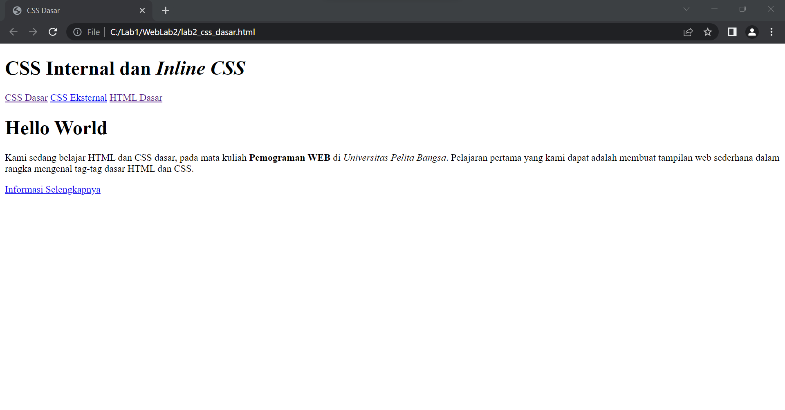
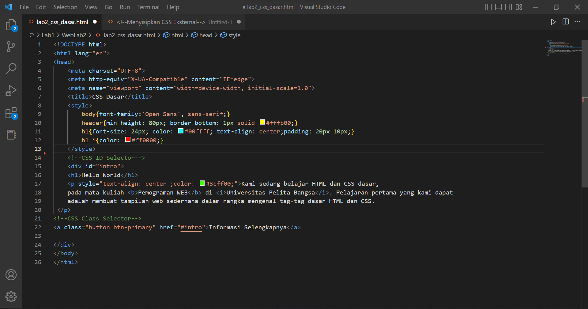
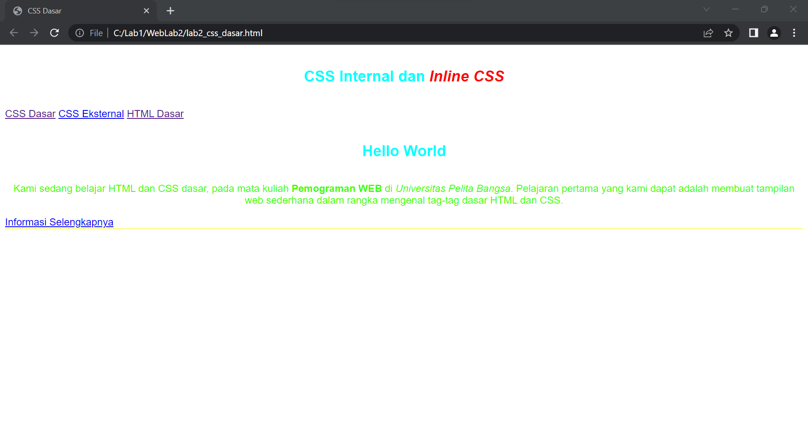
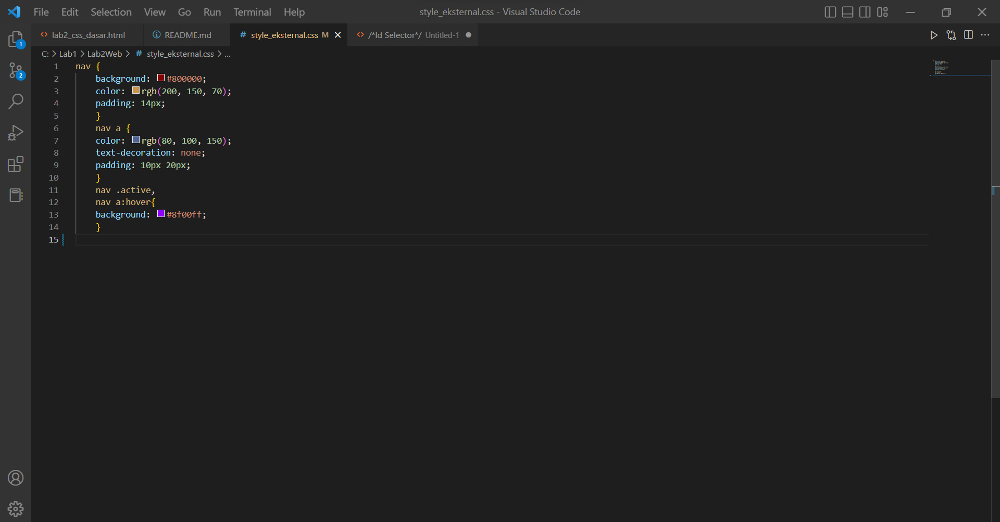

# Lab2Web
## Langkah-langkah Praktikum

### Membuat Dokumen HTML
Membuat CSS dasar
### 1. Buatlah dokumen HTML serperti berikut

#### Selanjutnya run program dan akan lansung menuju ke browser untuk melihat hasilnya

### 2.  Mendeklarasikan CSS Internal
#### Kemudian tambahkan deklarasi css internal seperti di gambar berikut

#### Selanjutnya simpan perubahan, dan lakukan run lagi untuk melihat hasilnya

### 3. Menambahkan Inline CSS
#### Kemudian tambahkan deklarasi inline CSS pada tag `
` seperti berikut. 

`
`

 

### Simpan kembali dan refresh kembali browser untuk melihat perubahannya

### 4. Membuat CSS Eksternal
#### Buat file baru terlebih dahulu dengan nama `style_.css` kemudian bautlah deklarasi CSS seperti berikut

Kemudian tambahkan tag `<link>` untuk menuju file css yang sudah dibuat pada bagian `<head>`

`<head>`
`<!-- menyisipkan css eksternal --> <link rel="stylesheet" href="style_eksternal.css" type="text/css">`
`<head>`
 

 

 Selanjutnya run lagi untuk melihat hasilnya
 

 

 

